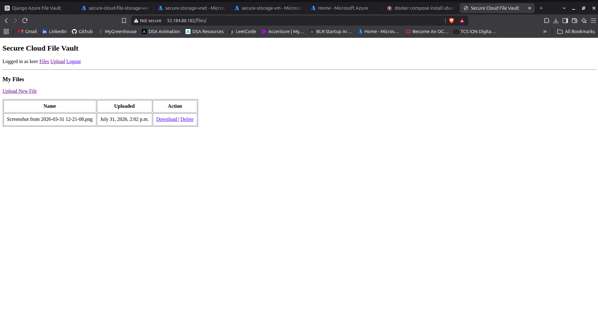
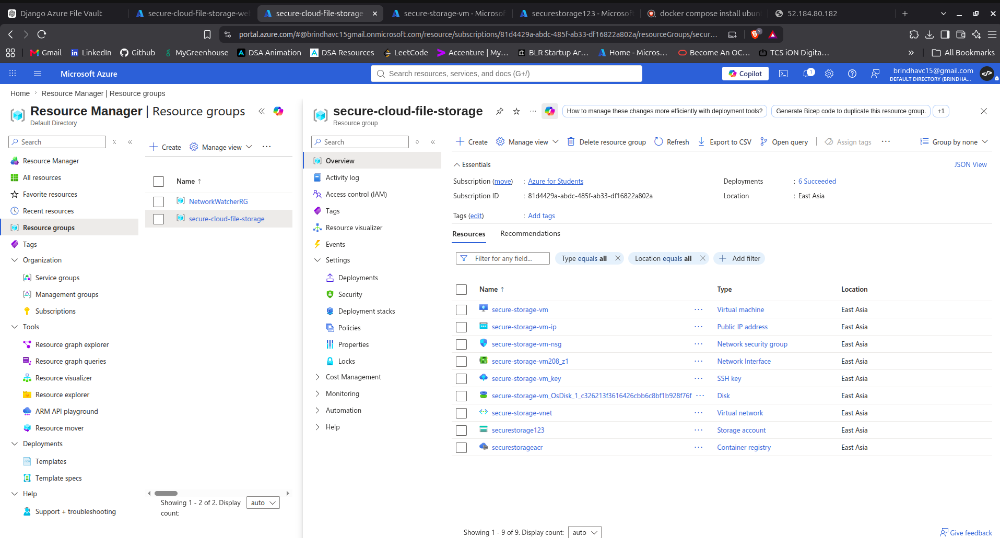
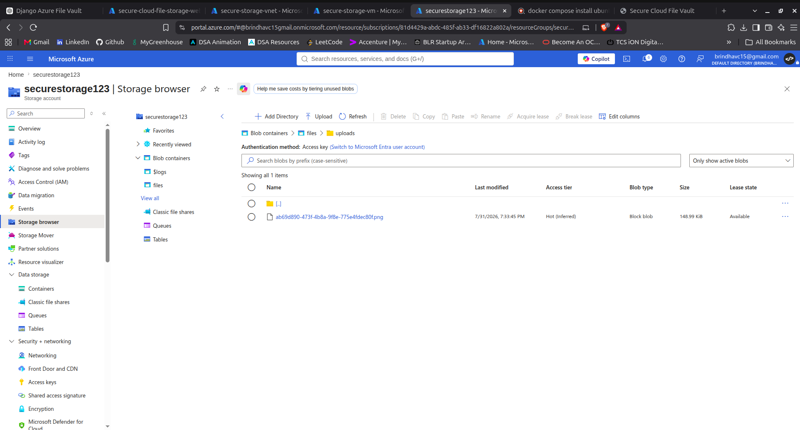
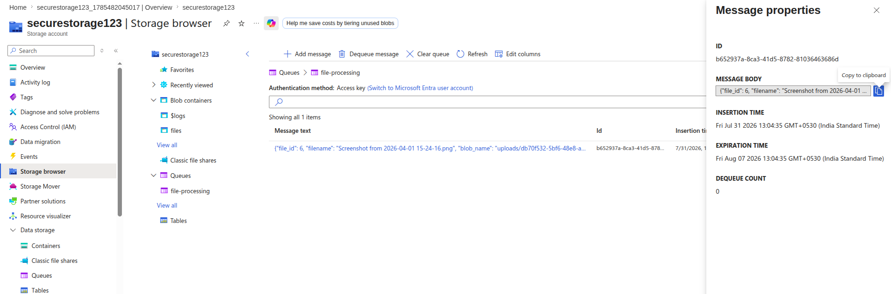
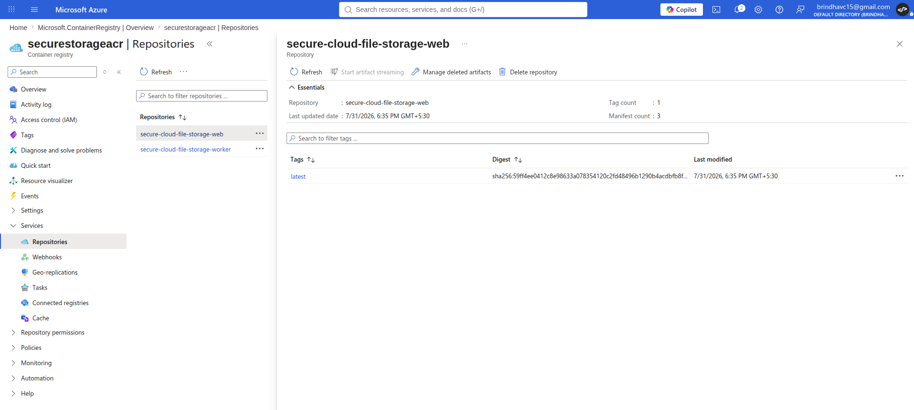
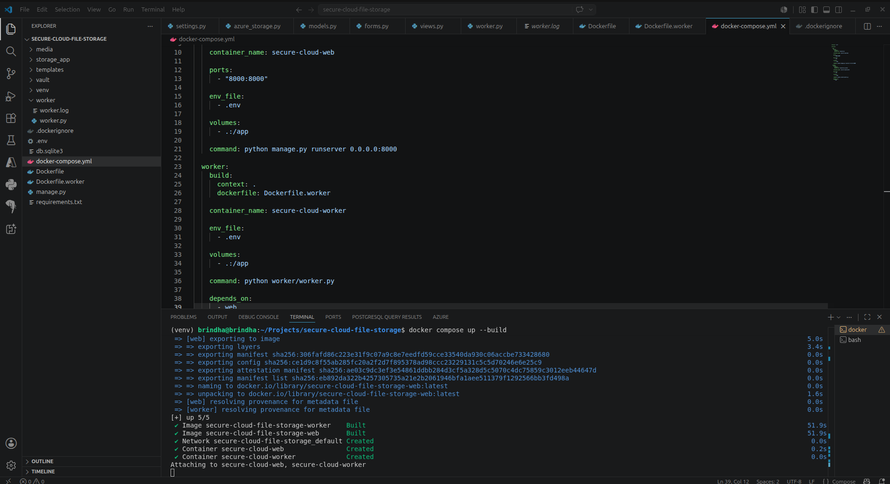

# Secure Cloud File Vault

A Django-based file management application built to demonstrate a real,
end-to-end Azure deployment — not just local development. Files are stored
in Azure Blob Storage (not on the VM), upload events are processed
asynchronously via Azure Queue Storage, and the app runs containerized on
an Azure VM inside a locked-down VNet.

**Live app:** `http://52.184.80.182/files/`

## Architecture

```
User → Django app (Docker container on Azure VM, inside secure-storage-vnet)
         │
         ├─→ Azure Blob Storage (securestorage123 → "files" container)
         │        — file bytes, not stored on the VM
         │
         └─→ Azure Queue Storage ("file-processing" queue)
                  │
                  └─→ worker.py (separate Docker container)
                        consumes upload events asynchronously
```

Deployed with `docker compose`, running two containers on the VM:
- `secure-cloud-web` — the Django app (Gunicorn, port 8000 → mapped to 80)
- `secure-cloud-worker` — the queue consumer, depends on `web`

Both images are built from the same codebase and pushed to a private
**Azure Container Registry (`securestorageacr`)** as two separate
repositories: `secure-cloud-file-storage-web` and
`secure-cloud-file-storage-worker`.

## Why this design

- **Blob Storage instead of local disk** — the app stays stateless. The VM
  could be rebuilt or replaced without losing any uploaded files.
- **Queue Storage instead of inline processing** — uploading a file enqueues
  a small JSON message (`file_id`, `filename`, `blob_name`) on the
  `file-processing` queue. The web container returns immediately; the
  worker container picks the message up independently, so a slow or
  failing post-processing step never blocks a user's upload request.
- **Separate containers for web and worker** — each can be scaled,
  restarted, or redeployed independently via `docker-compose.yml`'s
  `depends_on` relationship, rather than running both in one process.
- **VNet + NSG** — the VM sits inside `secure-storage-vnet`, protected by
  `secure-storage-vm-nsg`, which restricts inbound access rather than
  relying on Azure's open defaults.

## Azure resources (resource group: `secure-cloud-file-storage`)

| Resource | Type | Purpose |
|---|---|---|
| `secure-storage-vm` | Virtual Machine | Runs the Dockerized app |
| `secure-storage-vm-ip` | Public IP | Exposes the app to the internet |
| `secure-storage-vm-nsg` | Network Security Group | Restricts inbound traffic |
| `secure-storage-vnet` | Virtual Network | Isolates the VM's network |
| `secure-storage-vm_key` | SSH Key | Secure VM access |
| `securestorage123` | Storage Account | Hosts Blob container (`files`) and Queue (`file-processing`) |
| `securestorageacr` | Container Registry | Stores versioned `web` and `worker` images |

## Local development

```bash
python -m venv venv
source venv/bin/activate
pip install -r requirements.txt

cp .env.example .env   # fill in your Azure Storage connection string

docker compose up --build
```

This starts both the `web` and `worker` containers locally, wired to the
same Azure Storage account, so you can test the full flow — upload, blob
write, queue message, worker consumption — without touching the VM.

## Deploying to Azure

1. Build and tag both images:
   ```bash
   docker compose build
   ```
2. Push to Azure Container Registry:
   ```bash
   az acr login --name securestorageacr
   docker tag secure-cloud-file-storage-web securestorageacr.azurecr.io/secure-cloud-file-storage-web:latest
   docker tag secure-cloud-file-storage-worker securestorageacr.azurecr.io/secure-cloud-file-storage-worker:latest
   docker push securestorageacr.azurecr.io/secure-cloud-file-storage-web:latest
   docker push securestorageacr.azurecr.io/secure-cloud-file-storage-worker:latest
   ```
3. On the VM, pull and run via `docker-compose.yml` (or `docker run`),
   pointing at the ACR image tags above.

## Results

**Live application, running on the Azure VM:**



**Resource group — all provisioned Azure resources:**



**Blob Storage — uploaded file stored in the `files` container:**



**Queue Storage — upload event message picked up by the worker:**



**Azure Container Registry — versioned `web` and `worker` images:**



**Local build and deployment via docker compose:**



## What this project demonstrates

- Designing for statelessness by offloading file storage to Blob Storage
- Decoupling request handling from processing using a queue and a
  separate worker process/container
- Running a locked-down VM inside a custom VNet with NSG rules
- Building, tagging, and publishing multiple versioned images to a
  private container registry
- Running a multi-container app with `docker-compose` both locally and
  in production
